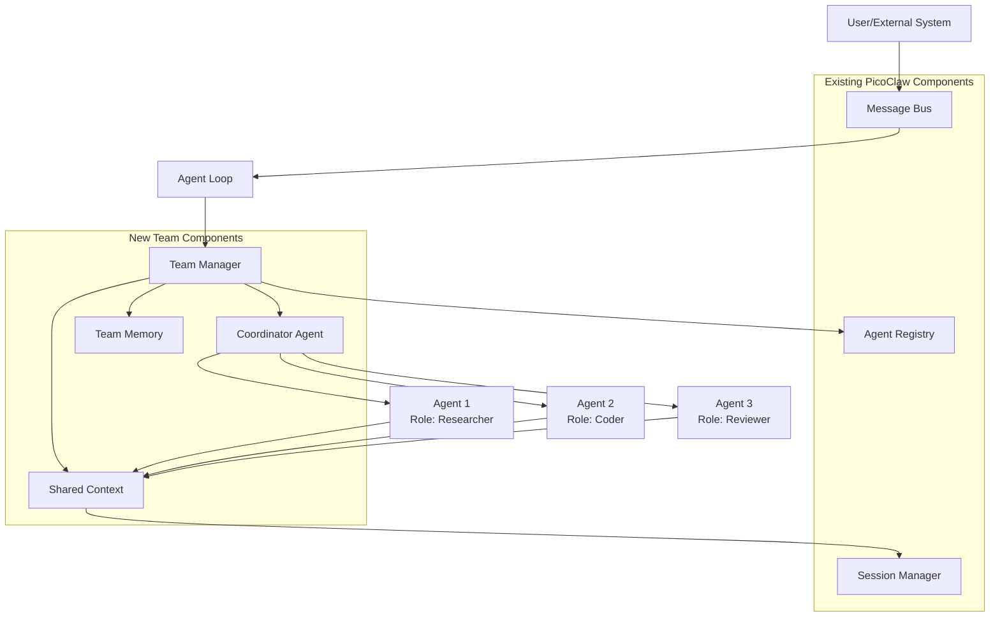
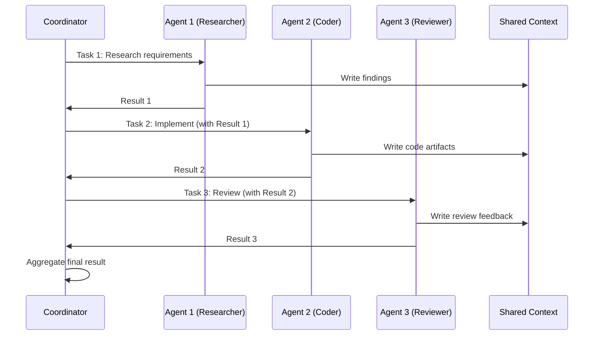
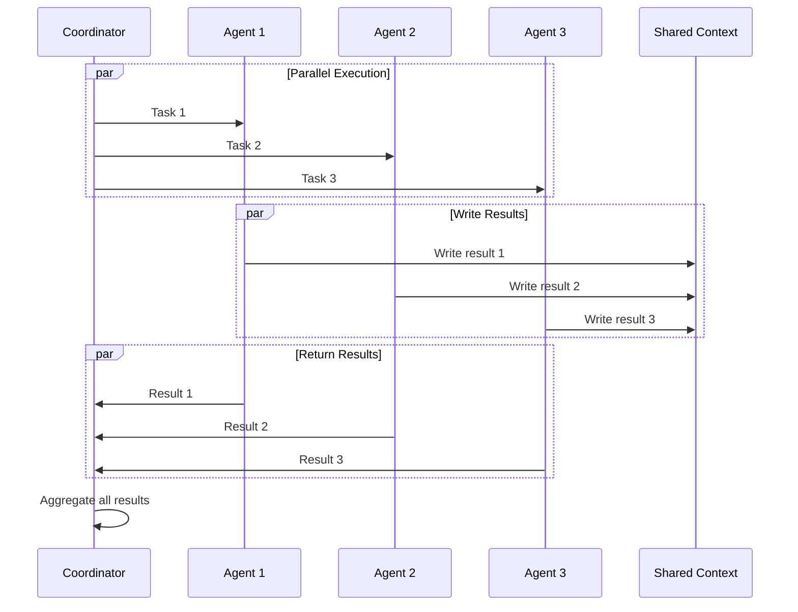
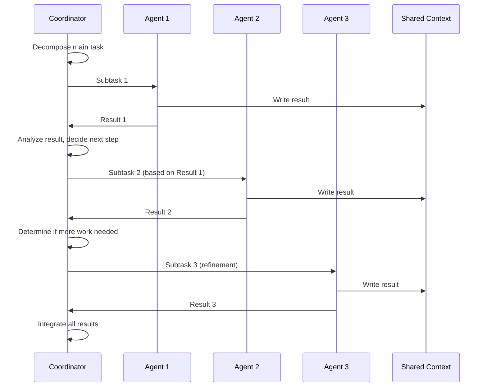

# Design Document: Multi-agent Collaboration Framework

## Overview

The Multi-agent Collaboration Framework extends PicoClaw's existing agent infrastructure to enable multiple AI agents to work together as coordinated teams. This design maintains PicoClaw's lightweight philosophy while adding powerful collaboration capabilities through role-based specialization, task delegation, shared context, and three distinct collaboration patterns (Sequential, Parallel, Hierarchical).

### Design Goals

- Seamless integration with existing PicoClaw components (Agent Registry, Message Bus, Memory)
- Minimal performance overhead (team creation <100ms, message delivery <10ms)
- Flexible configuration through JSON
- Support for dynamic team composition
- Robust error handling and recovery
- Comprehensive observability and monitoring

### Key Components

1. **Team Manager**: Orchestrates team lifecycle, composition, and coordination
2. **Coordinator Agent**: Specialized agent that manages workflow execution within a team
3. **Shared Context**: Thread-safe storage for team-wide information sharing
4. **Team Memory**: Persistent storage for team interactions and outcomes
5. **Delegation Router**: Routes tasks between team members based on roles and capabilities

## Architecture

### High-Level Architecture Diagram



### Component Integration

The framework integrates with existing PicoClaw components:

- **Agent Registry**: Manages all agent instances including team members
- **Message Bus**: Handles all inter-agent communication and task delegation
- **Session Manager**: Stores shared context alongside existing session data
- **Memory Store**: Extended to support team memory persistence
- **Agent Loop**: Enhanced to recognize and route team-related messages


## Components and Interfaces

### 1. Team Manager

The Team Manager is the central orchestrator for team operations.

**Responsibilities:**
- Create and configure teams from JSON configuration
- Register/deregister agents with the Agent Registry
- Monitor agent health and status
- Handle dynamic team composition changes
- Persist team memory
- Enforce tool access control based on roles

**Interface:**

```go
type TeamManager struct {
    registry      *agent.AgentRegistry
    bus           *bus.MessageBus
    teams         map[string]*Team
    roleCapabilities map[string][]string
    mu            sync.RWMutex
}

type Team struct {
    ID                string
    Name              string
    Pattern           CollaborationPattern
    Agents            map[string]*TeamAgent
    CoordinatorID     string
    SharedContext     *SharedContext
    Status            TeamStatus
    CreatedAt         time.Time
    Config            *TeamConfig
}

type TeamAgent struct {
    AgentID       string
    Role          string
    Capabilities  []string
    Status        AgentStatus
    FailureCount  int
    LastActive    time.Time
}

// Core methods
func NewTeamManager(registry *agent.AgentRegistry, bus *bus.MessageBus) *TeamManager
func (tm *TeamManager) CreateTeam(ctx context.Context, config *TeamConfig) (*Team, error)
func (tm *TeamManager) DissolveTeam(ctx context.Context, teamID string) error
func (tm *TeamManager) AddAgent(ctx context.Context, teamID string, agentConfig AgentConfig) error
func (tm *TeamManager) RemoveAgent(ctx context.Context, teamID, agentID string) error
func (tm *TeamManager) GetTeamStatus(teamID string) (*TeamStatus, error)
func (tm *TeamManager) DelegateTask(ctx context.Context, task *Task) error
func (tm *TeamManager) ValidateToolAccess(agentID, toolName string) bool
```

**Key Algorithms:**

1. **Team Creation**: Validates configuration, creates agents, initializes shared context, registers with Agent Registry
2. **Agent Health Monitoring**: Periodic heartbeat checks with 30-second timeout detection
3. **Dynamic Composition**: Lock-free updates using copy-on-write for agent list

### 2. Shared Context

Thread-safe storage for team-wide information accessible to all team members.

**Responsibilities:**
- Store key-value pairs with timestamps
- Maintain chronological history of team interactions
- Support concurrent reads from multiple agents
- Integrate with Session Manager for persistence

**Interface:**

```go
type SharedContext struct {
    teamID    string
    entries   map[string]*ContextEntry
    history   []*HistoryEntry
    mu        sync.RWMutex
    session   *agent.SessionManager
}

type ContextEntry struct {
    Key       string
    Value     interface{}
    Timestamp time.Time
    AgentID   string
}

type HistoryEntry struct {
    Timestamp time.Time
    AgentID   string
    Action    string
    Data      interface{}
}

// Core methods
func NewSharedContext(teamID string, session *agent.SessionManager) *SharedContext
func (sc *SharedContext) Set(key string, value interface{}, agentID string) error
func (sc *SharedContext) Get(key string) (interface{}, bool)
func (sc *SharedContext) GetAll() map[string]*ContextEntry
func (sc *SharedContext) GetHistory() []*HistoryEntry
func (sc *SharedContext) AddHistoryEntry(agentID, action string, data interface{})
func (sc *SharedContext) Snapshot() map[string]interface{}
```

**Concurrency Model:**
- Read-write mutex for safe concurrent access
- Optimized for high read throughput (multiple agents reading simultaneously)
- Write operations are serialized but fast (in-memory updates)

### 3. Coordinator Agent

Specialized agent responsible for orchestrating team workflows.

**Responsibilities:**
- Execute collaboration patterns (Sequential, Parallel, Hierarchical)
- Decompose tasks into subtasks
- Route tasks to appropriate agents based on roles
- Aggregate results from multiple agents
- Manage consensus protocols
- Handle workflow failures and retries

**Interface:**

```go
type CoordinatorAgent struct {
    *agent.AgentInstance
    team          *Team
    manager       *TeamManager
    pattern       CollaborationPattern
}

type Task struct {
    ID            string
    Description   string
    RequiredRole  string
    Context       map[string]interface{}
    ParentTaskID  string
    DelegationChain []string
    Status        TaskStatus
    Result        interface{}
    Error         error
}

// Core methods
func NewCoordinatorAgent(team *Team, manager *TeamManager) *CoordinatorAgent
func (ca *CoordinatorAgent) ExecuteWorkflow(ctx context.Context, task *Task) (interface{}, error)
func (ca *CoordinatorAgent) DelegateTask(ctx context.Context, task *Task, targetRole string) error
func (ca *CoordinatorAgent) AggregateResults(results []TaskResult) (interface{}, error)
func (ca *CoordinatorAgent) InitiateConsensus(ctx context.Context, question string, voters []string) (*ConsensusResult, error)
```

### 4. Team Memory

Persistent storage for team interactions and outcomes.

**Responsibilities:**
- Store completed team workflows
- Persist shared context snapshots
- Record consensus outcomes
- Enable post-analysis and learning

**Interface:**

```go
type TeamMemory struct {
    workspace string
    memoryDir string
}

type TeamMemoryRecord struct {
    TeamID        string
    TeamName      string
    Pattern       CollaborationPattern
    StartTime     time.Time
    EndTime       time.Time
    SharedContext map[string]interface{}
    Tasks         []TaskRecord
    Consensus     []ConsensusRecord
    Outcome       string
}

// Core methods
func NewTeamMemory(workspace string) *TeamMemory
func (tm *TeamMemory) SaveTeamRecord(record *TeamMemoryRecord) error
func (tm *TeamMemory) LoadTeamRecord(teamID string) (*TeamMemoryRecord, error)
func (tm *TeamMemory) ListTeamRecords() ([]string, error)
```

**Storage Format:**
- Directory: `{workspace}/memory/teams/`
- File naming: `{teamID}_{timestamp}.json`
- Atomic writes using `fileutil.WriteFileAtomic`

### 5. Delegation Router

Routes tasks between team members based on roles and capabilities.

**Responsibilities:**
- Match tasks to agents with required capabilities
- Prevent circular delegation loops
- Enforce delegation depth limits
- Queue tasks when no agent is available

**Interface:**

```go
type DelegationRouter struct {
    manager       *TeamManager
    maxDepth      int
    delegationMap map[string]*DelegationChain
    mu            sync.RWMutex
}

type DelegationChain struct {
    TaskID    string
    Chain     []string
    Depth     int
    CreatedAt time.Time
}

// Core methods
func NewDelegationRouter(manager *TeamManager, maxDepth int) *DelegationRouter
func (dr *DelegationRouter) RouteTask(ctx context.Context, task *Task, teamID string) (string, error)
func (dr *DelegationRouter) ValidateDelegation(task *Task, targetAgentID string) error
func (dr *DelegationRouter) RecordDelegation(task *Task, targetAgentID string)
```

## Data Models

### Team Configuration Schema

```json
{
  "team_id": "dev-team-001",
  "name": "Development Team",
  "pattern": "hierarchical",
  "roles": [
    {
      "name": "researcher",
      "capabilities": ["web_search", "document_analysis", "summarization"],
      "tools": ["webSearch", "webFetch", "readFile"],
      "model": "gpt-4o"
    },
    {
      "name": "coder",
      "capabilities": ["code_generation", "code_review", "testing"],
      "tools": ["readCode", "editCode", "fsWrite", "shell"],
      "model": "claude-sonnet-4"
    },
    {
      "name": "reviewer",
      "capabilities": ["code_review", "quality_assurance"],
      "tools": ["readCode", "getDiagnostics"],
      "model": "gpt-4o"
    }
  ],
  "coordinator": {
    "role": "coordinator",
    "agent_id": "coordinator-001"
  },
  "settings": {
    "max_delegation_depth": 5,
    "agent_timeout_seconds": 30,
    "failure_threshold": 3,
    "consensus_timeout_seconds": 60
  }
}
```

### Message Format for Task Delegation

```json
{
  "type": "task_delegation",
  "task_id": "task-12345",
  "from_agent": "coordinator-001",
  "to_agent": "coder-001",
  "team_id": "dev-team-001",
  "task": {
    "description": "Implement user authentication module",
    "required_role": "coder",
    "context": {
      "requirements": "...",
      "design_doc": "..."
    },
    "parent_task_id": "task-12340",
    "delegation_chain": ["coordinator-001"]
  },
  "timestamp": "2024-01-15T10:30:00Z"
}
```

### Task Result Message

```json
{
  "type": "task_result",
  "task_id": "task-12345",
  "from_agent": "coder-001",
  "to_agent": "coordinator-001",
  "team_id": "dev-team-001",
  "result": {
    "status": "completed",
    "output": "...",
    "artifacts": ["auth.go", "auth_test.go"],
    "execution_time_ms": 5420
  },
  "timestamp": "2024-01-15T10:35:20Z"
}
```

### Consensus Protocol Message

```json
{
  "type": "consensus_request",
  "consensus_id": "consensus-789",
  "from_agent": "coordinator-001",
  "team_id": "dev-team-001",
  "question": "Should we use PostgreSQL or MongoDB for the database?",
  "options": ["PostgreSQL", "MongoDB"],
  "voters": ["researcher-001", "coder-001", "reviewer-001"],
  "voting_rule": "majority",
  "timeout_seconds": 60,
  "timestamp": "2024-01-15T10:40:00Z"
}
```

### Enumerations

```go
type CollaborationPattern string

const (
    PatternSequential   CollaborationPattern = "sequential"
    PatternParallel     CollaborationPattern = "parallel"
    PatternHierarchical CollaborationPattern = "hierarchical"
)

type AgentStatus string

const (
    StatusIdle         AgentStatus = "idle"
    StatusWorking      AgentStatus = "working"
    StatusWaiting      AgentStatus = "waiting"
    StatusFailed       AgentStatus = "failed"
    StatusUnresponsive AgentStatus = "unresponsive"
)

type TaskStatus string

const (
    TaskStatusPending    TaskStatus = "pending"
    TaskStatusAssigned   TaskStatus = "assigned"
    TaskStatusInProgress TaskStatus = "in_progress"
    TaskStatusCompleted  TaskStatus = "completed"
    TaskStatusFailed     TaskStatus = "failed"
    TaskStatusCancelled  TaskStatus = "cancelled"
)

type TeamStatus string

const (
    TeamStatusInitializing TeamStatus = "initializing"
    TeamStatusActive       TeamStatus = "active"
    TeamStatusPaused       TeamStatus = "paused"
    TeamStatusDissolved    TeamStatus = "dissolved"
)

type VotingRule string

const (
    VotingRuleMajority   VotingRule = "majority"
    VotingRuleUnanimous  VotingRule = "unanimous"
    VotingRuleWeighted   VotingRule = "weighted"
)
```

## Collaboration Pattern Implementations

### Sequential Pattern

Agents execute tasks in a defined order, passing results from one to the next.

**Flow Diagram:**



**Implementation:**

```go
func (ca *CoordinatorAgent) ExecuteSequential(ctx context.Context, tasks []*Task) (interface{}, error) {
    var results []interface{}
    
    for i, task := range tasks {
        // Pass previous result as context
        if i > 0 {
            task.Context["previous_result"] = results[i-1]
        }
        
        result, err := ca.DelegateAndWait(ctx, task)
        if err != nil {
            return nil, fmt.Errorf("task %d failed: %w", i, err)
        }
        
        results = append(results, result)
    }
    
    return ca.AggregateResults(results)
}
```

### Parallel Pattern

Multiple agents work simultaneously on different aspects of a problem.

**Flow Diagram:**



**Implementation:**

```go
func (ca *CoordinatorAgent) ExecuteParallel(ctx context.Context, tasks []*Task) (interface{}, error) {
    var wg sync.WaitGroup
    results := make([]TaskResult, len(tasks))
    errors := make([]error, len(tasks))
    
    for i, task := range tasks {
        wg.Add(1)
        go func(idx int, t *Task) {
            defer wg.Done()
            result, err := ca.DelegateAndWait(ctx, t)
            results[idx] = TaskResult{Result: result, Error: err}
            errors[idx] = err
        }(i, task)
    }
    
    wg.Wait()
    
    // Check for failures
    var failedTasks []int
    for i, err := range errors {
        if err != nil {
            failedTasks = append(failedTasks, i)
        }
    }
    
    if len(failedTasks) > 0 {
        return nil, fmt.Errorf("tasks %v failed", failedTasks)
    }
    
    return ca.AggregateResults(results)
}
```

### Hierarchical Pattern

Coordinator decomposes tasks and dynamically routes based on intermediate results.

**Flow Diagram:**



**Implementation:**

```go
func (ca *CoordinatorAgent) ExecuteHierarchical(ctx context.Context, mainTask *Task) (interface{}, error) {
    // Decompose main task
    subtasks := ca.DecomposeTask(mainTask)
    
    var results []interface{}
    
    for len(subtasks) > 0 {
        task := subtasks[0]
        subtasks = subtasks[1:]
        
        result, err := ca.DelegateAndWait(ctx, task)
        if err != nil {
            // Decide whether to retry, reassign, or abort
            if ca.ShouldRetry(task, err) {
                subtasks = append(subtasks, task)
                continue
            }
            return nil, err
        }
        
        results = append(results, result)
        
        // Analyze intermediate result and potentially create new subtasks
        newSubtasks := ca.AnalyzeAndPlan(result, mainTask)
        subtasks = append(subtasks, newSubtasks...)
    }
    
    return ca.IntegrateResults(results, mainTask)
}
```

## Integration with Existing Components

### Agent Registry Integration

**Modifications to `pkg/agent/registry.go`:**

```go
// Add team-aware methods
func (r *AgentRegistry) RegisterTeamAgent(teamID, agentID string, role string) error
func (r *AgentRegistry) DeregisterTeamAgent(teamID, agentID string) error
func (r *AgentRegistry) GetTeamAgents(teamID string) ([]*AgentInstance, error)
func (r *AgentRegistry) GetAgentRole(agentID string) (string, error)
```

**Integration Points:**
- Team Manager calls `RegisterTeamAgent` during team creation
- Agent instances are tagged with team ID and role metadata
- Existing agent lifecycle management is reused

### Message Bus Integration

**New Message Types:**

```go
// Add to pkg/bus/messages.go
type TeamMessage struct {
    Type      string
    TeamID    string
    TaskID    string
    FromAgent string
    ToAgent   string
    Payload   interface{}
    Timestamp time.Time
}
```

**Message Routing:**
- Team messages use channel prefix `team:{team_id}`
- Message Bus filters by team ID for efficient routing
- Existing pub/sub mechanism handles all team communication

### Session Manager Integration

**Shared Context Storage:**

Shared Context integrates with existing Session Manager:

```go
// Shared context stored as special session key
sessionKey := fmt.Sprintf("team:%s:context", teamID)
session.AddMessage(sessionKey, "system", contextJSON)
```

**Benefits:**
- Reuses existing persistence mechanism
- Automatic cleanup with session management
- Consistent storage format

### Memory Store Integration

**Team Memory Extension:**

```go
// Add to pkg/agent/memory.go
func (ms *MemoryStore) WriteTeamMemory(teamID string, record *TeamMemoryRecord) error
func (ms *MemoryStore) ReadTeamMemory(teamID string) (*TeamMemoryRecord, error)
func (ms *MemoryStore) ListTeamMemories() ([]string, error)
```

**Storage Structure:**
```
workspace/
  memory/
    MEMORY.md              # Existing long-term memory
    teams/
      team-001_20240115.json
      team-002_20240116.json
```

### Spawn Tool Integration

The existing Spawn Tool is enhanced to support team context:

```go
// Modified spawn tool parameters
type SpawnParams struct {
    AgentID     string
    Task        string
    TeamID      string  // New: optional team context
    Role        string  // New: role for team member
}
```

**Integration Flow:**
1. Agent calls spawn tool with team context
2. Team Manager registers spawned agent as temporary team member
3. Spawned agent gets access to Shared Context
4. On completion, agent is automatically deregistered

## Configuration Schema

### Team Configuration File

Location: `{workspace}/teams/{team_name}.json`

```json
{
  "version": "1.0",
  "team": {
    "id": "dev-team-001",
    "name": "Development Team",
    "description": "Full-stack development team with research, coding, and review capabilities",
    "pattern": "hierarchical"
  },
  "roles": [
    {
      "name": "researcher",
      "description": "Researches requirements and gathers information",
      "capabilities": ["web_search", "document_analysis", "summarization"],
      "tools": ["webSearch", "webFetch", "readFile", "readCode"],
      "model": "gpt-4o",
      "max_tokens": 4096,
      "temperature": 0.7
    }
  ]
}
```

### Global Configuration Extension

Add to `config.json`:

```json
{
  "teams": {
    "enabled": true,
    "config_dir": "teams",
    "defaults": {
      "max_delegation_depth": 5,
      "agent_timeout_seconds": 30,
      "failure_threshold": 3,
      "consensus_timeout_seconds": 60,
      "max_spawned_agents": 10
    },
    "templates": {
      "development": "teams/templates/development.json",
      "research": "teams/templates/research.json",
      "analysis": "teams/templates/analysis.json"
    }
  }
}
```

### Template Configurations

**Development Team Template:**

```json
{
  "pattern": "hierarchical",
  "roles": [
    {"name": "researcher", "capabilities": ["web_search", "document_analysis"]},
    {"name": "coder", "capabilities": ["code_generation", "testing"]},
    {"name": "reviewer", "capabilities": ["code_review", "quality_assurance"]}
  ]
}
```

**Research Team Template:**

```json
{
  "pattern": "parallel",
  "roles": [
    {"name": "web_researcher", "capabilities": ["web_search"]},
    {"name": "document_analyst", "capabilities": ["document_analysis"]},
    {"name": "synthesizer", "capabilities": ["summarization", "integration"]}
  ]
}
```

## Error Handling

### Failure Detection and Recovery

**Agent Failure Detection:**
- Heartbeat mechanism with 30-second timeout
- Automatic status updates (idle → working → failed)
- Failure count tracking per agent

**Recovery Strategies:**

1. **Task Retry**: Retry failed task on same agent (max 3 attempts)
2. **Task Reassignment**: Assign task to different agent with same role
3. **Workflow Abort**: Stop workflow and report failure to user

**Circular Delegation Prevention:**

```go
func (dr *DelegationRouter) ValidateDelegation(task *Task, targetAgentID string) error {
    // Check if target is already in delegation chain
    for _, agentID := range task.DelegationChain {
        if agentID == targetAgentID {
            return fmt.Errorf("circular delegation detected: %s already in chain", targetAgentID)
        }
    }
    
    // Check delegation depth
    if len(task.DelegationChain) >= dr.maxDepth {
        return fmt.Errorf("max delegation depth %d exceeded", dr.maxDepth)
    }
    
    return nil
}
```

### Error Scenarios and Handling

| Scenario | Detection | Recovery Action |
|----------|-----------|-----------------|
| Agent unresponsive | Heartbeat timeout (30s) | Mark as failed, reassign tasks |
| Task execution failure | Error return from agent | Retry or reassign based on failure count |
| Circular delegation | Delegation chain check | Reject delegation, log attempt |
| Max depth exceeded | Chain length check | Return error to delegating agent |
| No available agent | Role matching failure | Queue task or notify coordinator |
| Consensus timeout | Timer expiration | Proceed with available votes or fail |
| Configuration invalid | JSON validation | Return descriptive error, reject creation |
| Tool access denied | Permission check | Deny request, log attempt |

## Testing Strategy

### Dual Testing Approach

This framework requires both unit tests and property-based tests for comprehensive coverage:

**Unit Tests:**
- Specific examples of team creation with known configurations
- Edge cases (empty teams, single agent, max agents)
- Error conditions (invalid JSON, missing roles, circular delegation)
- Integration points (Agent Registry, Message Bus, Session Manager)
- Template loading and variable substitution

**Property-Based Tests:**
- Universal properties across all valid inputs
- Randomized team configurations, agent counts, task distributions
- Concurrent operations (multiple agents reading/writing shared context)
- Workflow execution across all collaboration patterns
- Minimum 100 iterations per property test

**Property Test Configuration:**

For Go, we'll use `gopter` (property-based testing library):

```go
import (
    "testing"
    "github.com/leanovate/gopter"
    "github.com/leanovate/gopter/gen"
    "github.com/leanovate/gopter/prop"
)

func TestTeamProperties(t *testing.T) {
    properties := gopter.NewProperties(nil)
    properties.Property("Feature: multi-agent-collaboration-framework, Property 1: Team IDs are unique",
        prop.ForAll(
            func(configs []TeamConfig) bool {
                // Test implementation
            },
            gen.SliceOf(genTeamConfig()),
        ))
    properties.TestingRun(t, gopter.ConsoleReporter(false))
}
```

Each property test must:
- Run minimum 100 iterations
- Reference its design document property in a comment
- Use tag format: `Feature: multi-agent-collaboration-framework, Property {number}: {property_text}`

## Correctness Properties

*A property is a characteristic or behavior that should hold true across all valid executions of a system-essentially, a formal statement about what the system should do. Properties serve as the bridge between human-readable specifications and machine-verifiable correctness guarantees.*

### Property 1: Team Creation Uniqueness

*For any* sequence of team creation requests, all created teams should have unique identifiers with no collisions.

**Validates: Requirements 1.1**

### Property 2: Team Configuration Completeness

*For any* valid team configuration containing roles, capabilities, and collaboration pattern, creating a team should result in a team with all specified roles assigned, all capabilities mapped, and the correct pattern set.

**Validates: Requirements 1.2, 1.3, 2.4**

### Property 3: Agent Registry Integration

*For any* team with N agents, after team creation, exactly N agents should be registered in the Agent Registry, and after team dissolution, all N agents should be deregistered.

**Validates: Requirements 1.4, 11.1, 11.4**

### Property 4: Shared Context Initialization

*For any* newly created team, the shared context should exist, be empty, and be accessible to all team members.

**Validates: Requirements 1.5, 4.1**

### Property 5: Role Assignment Uniqueness

*For any* agent in a team, the agent should have exactly one role (not zero, not multiple) with all capabilities defined for that role.

**Validates: Requirements 2.1, 2.2**

### Property 6: Tool Access Control

*For any* agent with a specific role, attempting to use a tool not permitted for that role should be denied, and attempting to use a permitted tool should succeed.

**Validates: Requirements 2.3, 16.1, 16.2, 16.3**

### Property 7: Task Delegation Round-Trip

*For any* task delegated from agent A to agent B, agent B should receive the task with all context, complete it, and return results to agent A.

**Validates: Requirements 3.1, 3.2, 3.3, 3.4, 3.6**

### Property 8: Shared Context Visibility

*For any* data written to shared context by one agent, all other agents in the team should be able to read that data immediately.

**Validates: Requirements 4.1, 4.2**

### Property 9: Shared Context History Ordering

*For any* sequence of operations on shared context, the history should maintain chronological order with accurate timestamps.

**Validates: Requirements 4.3, 4.6**

### Property 10: Team Memory Persistence Round-Trip

*For any* team that completes a workflow, dissolving the team should persist all shared context, task records, and consensus outcomes to team memory, and this data should be retrievable.

**Validates: Requirements 4.8, 13.1, 13.2, 13.3, 13.4, 13.5**

### Property 11: Sequential Execution Order

*For any* team using sequential collaboration pattern with N tasks, tasks should execute in order (task i completes before task i+1 starts), and the output of task i should be available as input to task i+1.

**Validates: Requirements 5.1, 5.2, 5.3**

### Property 12: Sequential Failure Halts Workflow

*For any* sequential workflow where task i fails, no subsequent tasks (i+1, i+2, ...) should execute, and the workflow should report the failure.

**Validates: Requirements 5.4**

### Property 13: Parallel Execution Simultaneity

*For any* team using parallel collaboration pattern with N tasks, all N tasks should start within a short time window (< 100ms), and the coordinator should wait for all to complete before proceeding.

**Validates: Requirements 6.1, 6.3**

### Property 14: Parallel Result Aggregation

*For any* parallel workflow with N tasks, the coordinator should collect and aggregate exactly N results (or N failures).

**Validates: Requirements 6.2, 6.4, 6.5**

### Property 15: Hierarchical Task Decomposition

*For any* hierarchical workflow, the main task should be decomposed into subtasks, each subtask should be assigned to an agent with the appropriate role, and all subtask results should be integrated into the final result.

**Validates: Requirements 7.1, 7.2, 7.4**

### Property 16: Consensus Vote Collection

*For any* consensus protocol with N voters, all N voters should receive vote requests, and the coordinator should collect all votes submitted within the timeout period.

**Validates: Requirements 8.1, 8.2, 8.3**

### Property 17: Consensus Voting Rules

*For any* consensus protocol using majority rule with N votes, the outcome should be the option with > N/2 votes; for unanimous rule, all votes must match; for weighted rule, the outcome should be determined by weighted sum.

**Validates: Requirements 8.4**

### Property 18: Consensus Result Persistence

*For any* completed consensus protocol, the voting results (all votes, outcome, timestamp) should be recorded in shared context.

**Validates: Requirements 8.5**

### Property 19: Agent Status Tracking

*For any* agent in a team, the team manager should maintain accurate status (idle, working, waiting, failed) that reflects the agent's actual state.

**Validates: Requirements 9.1**

### Property 20: Task Metrics Recording

*For any* task executed by a team, the team manager should record start time, end time, and agent assignment.

**Validates: Requirements 9.2**

### Property 21: Agent Failure Detection

*For any* agent that becomes unresponsive, the team manager should detect the failure within 30 seconds, update the agent status to failed, and notify the coordinator.

**Validates: Requirements 9.5, 9.6, 14.1, 14.2**

### Property 22: Dynamic Agent Addition

*For any* active team, adding a new agent should result in the agent being registered, granted access to shared context, and included in the team roster without disrupting ongoing operations.

**Validates: Requirements 10.1, 10.2, 10.6**

### Property 23: Dynamic Agent Removal with Task Reassignment

*For any* agent removed from a team, all active tasks assigned to that agent should be reassigned to other agents with the same role, and all team members should be notified of the composition change.

**Validates: Requirements 10.3, 10.4, 10.5**

### Property 24: Message Bus Communication

*For any* task delegation or result, the message should be sent through the message bus, routed to the correct agent based on agent identifier, and filtered by team identifier.

**Validates: Requirements 12.1, 12.2, 12.4, 12.6**

### Property 25: Circular Delegation Prevention

*For any* task with delegation chain [A, B, C], attempting to delegate to A, B, or C should be rejected, and the rejection should be logged.

**Validates: Requirements 18.1, 18.2, 18.5**

### Property 26: Delegation Depth Limit

*For any* task with delegation chain of length D, where D equals the configured max depth, attempting to delegate further should return an error to the delegating agent.

**Validates: Requirements 18.3, 18.4**

### Property 27: Configuration Validation

*For any* team configuration, if the configuration is valid JSON with all required fields (roles, capabilities, pattern), team creation should succeed; if any required field is missing or invalid, creation should fail with a descriptive error message.

**Validates: Requirements 15.1, 15.2, 15.3, 15.6**

### Property 28: Configuration Template Variables

*For any* team configuration containing template variables, the variables should be substituted with actual values before team creation.

**Validates: Requirements 15.5**

### Property 29: Wildcard Tool Permissions

*For any* role with wildcard tool permission pattern (e.g., "file_*"), agents with that role should be able to access all tools matching the pattern.

**Validates: Requirements 16.6**

### Property 30: Subagent Lifecycle

*For any* spawned subagent, it should be registered as a temporary team member with access to shared context, and automatically deregistered when its task completes, with results returned to the spawning agent.

**Validates: Requirements 17.1, 17.2, 17.3, 17.4, 17.5**

### Property 31: Spawned Subagent Limit

*For any* team with a configured max spawned agents limit of N, attempting to spawn the (N+1)th subagent should be rejected.

**Validates: Requirements 17.6**

### Property 32: Result Aggregation with Attribution

*For any* workflow with multiple agents contributing results, the final aggregated result should include all agent contributions with clear attribution showing which agent produced each part.

**Validates: Requirements 19.1, 19.5**

### Property 33: Failure Threshold Enforcement

*For any* agent with a failure threshold of N, after N failures, the agent should be automatically removed from the team.

**Validates: Requirements 14.4, 14.5**

### Property 34: Failure Logging

*For any* agent failure, the failure should be logged to team memory with timestamp, agent ID, task ID, and error details.

**Validates: Requirements 14.6**

### Property 35: Team Creation Performance

*For any* team with 10 agents, team creation (including agent registration and shared context initialization) should complete within 100 milliseconds.

**Validates: Requirements 20.1**

### Property 36: Message Delivery Performance

*For any* task delegation message, delivery through the message bus should complete within 10 milliseconds.

**Validates: Requirements 20.2**

### Property 37: Concurrent Shared Context Access

*For any* shared context with N agents reading simultaneously, all reads should succeed and return consistent data without blocking or data corruption.

**Validates: Requirements 20.3**

### Property 38: Team Memory Overhead

*For any* team, the memory overhead (excluding agent instances) should be less than 10 MB.

**Validates: Requirements 20.5**

### Property 39: Agent Instance Reuse

*For any* sequence of tasks assigned to the same role, the same agent instance should be reused rather than creating new instances.

**Validates: Requirements 20.6**

## Performance Considerations

### Optimization Strategies

1. **Connection Pooling**: Reuse agent connections for multiple tasks
2. **Lazy Initialization**: Create agents only when first needed
3. **Copy-on-Write**: Use immutable data structures for shared context to enable lock-free reads
4. **Message Batching**: Batch multiple task delegations into single message bus operations
5. **Caching**: Cache role-to-capability mappings and agent availability status

### Performance Targets

| Operation | Target | Measurement Method |
|-----------|--------|-------------------|
| Team creation (10 agents) | < 100ms | Benchmark test |
| Message delivery | < 10ms | Message bus latency tracking |
| Shared context read | < 1ms | Concurrent read benchmark |
| Shared context write | < 5ms | Write operation timing |
| Agent status query | < 1ms | Query response time |
| Task delegation | < 20ms | End-to-end delegation timing |
| Memory per team | < 10MB | Runtime memory profiling |

### Scalability Considerations

**Horizontal Scaling:**
- Teams are independent and can run on separate processes
- Message bus supports distributed deployment
- Shared context can be backed by distributed cache (Redis)

**Vertical Scaling:**
- Concurrent agent execution within a team
- Parallel pattern maximizes CPU utilization
- Lock-free reads minimize contention

**Resource Limits:**
- Max agents per team: 100 (configurable)
- Max concurrent teams: 50 (configurable)
- Max delegation depth: 10 (configurable)
- Max spawned subagents per team: 20 (configurable)

## Implementation Phases

### Phase 1: Core Infrastructure (Weeks 1-2)
- Team Manager implementation
- Shared Context with concurrency support
- Basic team creation and dissolution
- Agent Registry integration

### Phase 2: Collaboration Patterns (Weeks 3-4)
- Sequential pattern implementation
- Parallel pattern implementation
- Hierarchical pattern implementation
- Coordinator Agent logic

### Phase 3: Advanced Features (Weeks 5-6)
- Consensus mechanisms
- Dynamic team composition
- Delegation router with circular prevention
- Tool access control

### Phase 4: Integration and Persistence (Week 7)
- Message Bus integration
- Team Memory persistence
- Session Manager integration
- Configuration system

### Phase 5: Testing and Optimization (Week 8)
- Property-based tests for all 39 properties
- Unit tests for edge cases
- Performance benchmarking
- Memory profiling and optimization

## Security Considerations

### Access Control
- Role-based tool access prevents unauthorized operations
- Agent isolation ensures agents can't access other teams' contexts
- Configuration validation prevents injection attacks

### Data Protection
- Shared context data is team-scoped
- Team memory is stored with appropriate file permissions (0600)
- Sensitive data in configurations should use environment variables

### Audit Trail
- All task delegations logged to message bus
- All failures logged to team memory
- Circular delegation attempts logged for security analysis

## Monitoring and Observability

### Metrics to Track
- Team creation/dissolution rate
- Task delegation rate and latency
- Agent failure rate
- Consensus protocol success rate
- Message bus throughput
- Shared context read/write operations
- Memory usage per team

### Logging Strategy
- Structured logging with team ID, agent ID, task ID
- Log levels: DEBUG (detailed flow), INFO (key events), WARN (recoverable errors), ERROR (failures)
- Integration with existing PicoClaw logger

### Health Checks
- Agent heartbeat monitoring
- Message bus connectivity
- Shared context accessibility
- Team Manager responsiveness

## Future Enhancements

### Potential Extensions
1. **Cross-Team Collaboration**: Allow agents from different teams to collaborate
2. **Agent Learning**: Agents learn from past team interactions
3. **Advanced Consensus**: Support for more voting algorithms (ranked choice, approval voting)
4. **Team Templates**: Pre-built team configurations for common use cases
5. **Visual Team Dashboard**: Real-time visualization of team activity
6. **Agent Specialization**: Agents improve at their roles over time
7. **Resource Quotas**: CPU/memory limits per team
8. **Team Scheduling**: Queue and schedule team workflows

## Conclusion

This design provides a comprehensive, lightweight, and extensible multi-agent collaboration framework that integrates seamlessly with PicoClaw's existing architecture. The framework supports three collaboration patterns, robust error handling, dynamic team composition, and comprehensive observability while maintaining performance targets suitable for production use.

The 39 correctness properties ensure the system behaves correctly across all scenarios, and the dual testing approach (unit + property-based) provides confidence in the implementation's correctness and robustness.
