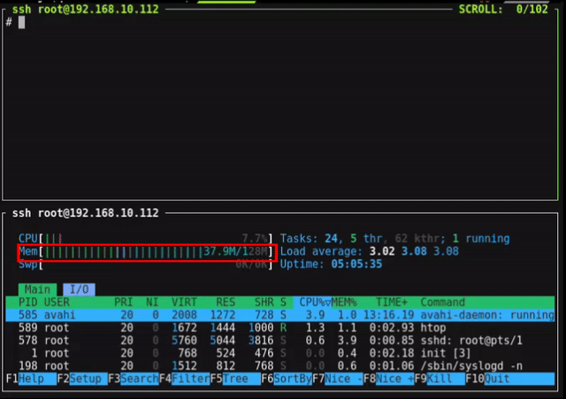
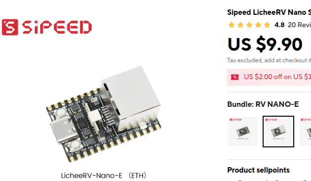

<div align="center">
  

  <h1>PicoClaw: Assistente de IA Ultra-Eficiente em Go</h1>

  <h3>Hardware de $10 · 10MB de RAM · Boot em 1s · 皮皮虾，我们走！</h3>

  <p>
    
    
    
    <br>
    <a href="https://picoclaw.io"></a>
    <a href="https://x.com/SipeedIO"></a>
    <br>
    <a href="./assets/wechat.png"></a>
    <a href="https://discord.gg/V4sAZ9XWpN"></a>
  </p>

[中文](README.zh.md) | [日本語](README.ja.md) | **Português** | [Tiếng Việt](README.vi.md) | [Français](README.fr.md) | [English](README.md)

</div>

---

## 🚀 O que é PicoClaw?

PicoClaw é um assistente pessoal de IA ultra-leve construído em Go, projetado para rodar em hardware mínimo com máxima eficiência.

⚡️ **Roda em hardware de $10 com <10MB de RAM** — 99% menos memória que OpenClaw e 98% mais barato que um Mac mini!

🦐 Inspirado no [nanobot](https://github.com/HKUDS/nanobot), refatorado do zero através de um processo de auto-inicialização (self-bootstrapping) conduzido por IA.

<table align="center">
  <tr align="center">
    <td align="center" valign="top">
      <p align="center">
        
      </p>
    </td>
    <td align="center" valign="top">
      <p align="center">
        
      </p>
    </td>
  </tr>
</table>

> [!CAUTION]
> **🚨 SEGURANÇA & CANAIS OFICIAIS**
>
> * **SEM CRIPTO:** PicoClaw **NÃO** possui nenhum token/moeda oficial. Todas as alegações são **GOLPES**.
> * **DOMÍNIO OFICIAL:** Apenas **[picoclaw.io](https://picoclaw.io)** e **[sipeed.com](https://sipeed.com)**
> * **Aviso:** Em estágio inicial de desenvolvimento - não recomendado para produção antes da v1.0
> * **Nota:** PRs recentes podem aumentar temporariamente o uso de memória para 10-20MB

---

## ✨ Recursos Principais

| Recurso | Descrição |
|---------|-------------|
| 🪶 **Ultra-Leve** | <10MB RAM — 99% menor que alternativas |
| 💰 **Custo Mínimo** | Roda em hardware de $10 — 98% mais barato |
| ⚡️ **Super Rápido** | Boot em 1s mesmo em CPU single-core de 0.6GHz |
| 🌍 **Verdadeiramente Portátil** | Binário único para RISC-V, ARM, x86 |
| 🤖 **Auto-Construído por IA** | 95% do código gerado por agente com refinamento humano |
| 🤝 **Times Multi-Agente** | Coordene agentes de IA especializados |
| 💬 **Chat Colaborativo** | Conversas multi-agente estilo IRC no Telegram |
| 🔓 **Segurança Flexível** | Sistema de segurança de 4 níveis para controle de LLM |

---

## 📦 Início Rápido

### 1. Instalar

**Baixar binário pré-compilado:**
```bash
# Baixe de https://github.com/sipeed/picoclaw/releases
wget https://github.com/sipeed/picoclaw/releases/download/v0.1.1/picoclaw-linux-amd64
chmod +x picoclaw-linux-amd64
```

**Ou compilar do código-fonte:**
```bash
git clone https://github.com/sipeed/picoclaw.git
cd picoclaw
make build
```

### 2. Inicializar

```bash
picoclaw onboard
```

### 3. Configurar

Edite `~/.picoclaw/config.json`:

```json
{
  "agents": {
    "defaults": {
      "model": "gpt-5.2"
    }
  },
  "model_list": [
    {
      "model_name": "gpt-5.2",
      "model": "openai/gpt-5.2",
      "api_key": "your-api-key"
    }
  ]
}
```

**Obter Chaves API:**
- LLM: [OpenRouter](https://openrouter.ai/keys) · [Zhipu](https://open.bigmodel.cn) · [Anthropic](https://console.anthropic.com)
- Busca (opcional): [Tavily](https://tavily.com) · [Brave](https://brave.com/search/api)

### 4. Conversar

```bash
picoclaw agent -m "Quanto é 2+2?"
```

---

## 🤝 Colaboração Multi-Agente

Coordene times de agentes de IA especializados com capacidades baseadas em funções:

**Três Padrões de Colaboração:**
- 🔄 **Sequencial**: Tarefas executam em ordem (design → implementar → testar → revisar)
- ⚡ **Paralelo**: Tarefas executam simultaneamente para velocidade
- 🌳 **Hierárquico**: Tarefas complexas se decompõem dinamicamente

**Exemplo Rápido:**

```bash
# Criar time de desenvolvimento
picoclaw team create templates/teams/development-team.json

# Executar tarefa
picoclaw team execute dev-team-001 -t "Criar uma função hello world"

# Verificar status
picoclaw team status dev-team-001
```

**Recursos Principais:**
- 👥 Especialização baseada em função com permissões de ferramentas
- 🗳️ Votação por consenso (maioria/unânime/ponderada)
- 🔄 Composição dinâmica de agentes
- 📊 Monitoramento abrangente
- 💾 Persistência automática de memória

📖 **Saiba Mais**: [Guia Multi-Agente](docs/MULTI_AGENT_GUIDE.md) | [Exemplos](examples/teams/)

---

## 💬 Chat Colaborativo (NOVO!)

**Conversas multi-agente estilo IRC no Telegram** — mencione vários agentes em uma única mensagem e todos responderão com contexto completo!

```
User: @architect @developer Como devemos implementar autenticação de usuário?

[abc123] 🏗️ ARCHITECT: Recomendo usar tokens JWT com...
[abc123] 💻 DEVELOPER: Posso implementar isso usando...
```

**Configuração Rápida:**

1. Habilitar na configuração:
```json
{
  "channels": {
    "telegram": {
      "collaborative_chat": {
        "enabled": true,
        "default_team_id": "dev-team",
        "max_context_length": 50
      }
    }
  }
}
```

2. Criar configuração de time (veja [templates/teams/collaborative-dev-team.json](templates/teams/collaborative-dev-team.json))

3. Iniciar gateway: `picoclaw gateway`

**Recursos:**
- 🎯 Roteamento baseado em @menção (@architect, @developer, @tester)
- ⚡ Execução paralela de agentes
- 🧠 Contexto de conversa compartilhado
- 🎨 Formatação estilo IRC com emojis
- 📝 Gerenciamento de sessão por chat
- 👥 Comando `/who` - Ver todos os agentes registrados e sessões ativas

**Comandos:**
- `/who` - Mostrar status do time, agentes registrados e agentes ativos
- `/help` - Mostrar comandos disponíveis

📖 **Saiba Mais**: [Início Rápido](docs/COLLABORATIVE_CHAT_QUICKSTART.md) | [Guia Completo](docs/COLLABORATIVE_CHAT.md)

---

## 🔒 Segurança & Proteção

### Sistema de Segurança de 4 Níveis

Escolha o equilíbrio certo entre segurança e autonomia:

| Nível | Melhor Para | Bloqueia | Permite |
|-------|----------|--------|--------|
| **strict** | Produção | sudo, chmod, docker, instalação de pacotes | Leitura, build, teste, git seguro |
| **moderate** | Desenvolvimento (padrão) | Apenas operações catastróficas | Maioria das operações de dev |
| **permissive** | DevOps/Admin | Apenas operações catastróficas | Quase tudo |
| **off** | Teste ⚠️ | Nada | Tudo (PERIGOSO!) |

**Configuração:**

```json
{
  "tools": {
    "exec": {
      "safety_level": "moderate",
      "custom_allow_patterns": ["\\bgit\\s+push\\s+--force\\b"]
    }
  }
}
```

📖 **Documentação Completa**: [Guia de Níveis de Segurança](docs/SAFETY_LEVELS.md) | [Início Rápido](docs/SAFETY_QUICKSTART.md)

---

## 💬 Integração com Apps de Chat

Conecte ao Telegram, Discord, WhatsApp, QQ, DingTalk, LINE, WeCom e mais.

**Configuração Rápida (Telegram):**

1. Criar bot com [@BotFather](https://t.me/BotFather)
2. Configurar:
```json
{
  "channels": {
    "telegram": {
      "enabled": true,
      "token": "YOUR_BOT_TOKEN",
      "allow_from": ["YOUR_USER_ID"]
    }
  }
}
```
3. Executar: `picoclaw gateway`

📖 **Mais Canais**: Veja [seções do README](#-chat-apps) para Discord, WhatsApp, QQ, etc.

---

## 🐳 Docker Compose

```bash
# Clonar repo
git clone https://github.com/sipeed/picoclaw.git
cd picoclaw

# Primeira execução (gera config)
docker compose -f docker/docker-compose.yml --profile gateway up

# Editar config
vim docker/data/config.json

# Iniciar
docker compose -f docker/docker-compose.yml --profile gateway up -d
```

---

## ⚙️ Configuração

### Provedores Suportados

| Provedor | Propósito | Obter Chave API |
|----------|---------|-------------|
| OpenAI | Modelos GPT | [platform.openai.com](https://platform.openai.com) |
| Anthropic | Modelos Claude | [console.anthropic.com](https://console.anthropic.com) |
| Zhipu | Modelos GLM (Chinês) | [bigmodel.cn](https://bigmodel.cn) |
| OpenRouter | Todos os modelos | [openrouter.ai](https://openrouter.ai) |
| Gemini | Modelos Google | [aistudio.google.com](https://aistudio.google.com) |
| Groq | Inferência rápida | [console.groq.com](https://console.groq.com) |
| Ollama | Modelos locais | Local (sem chave) |

### Configuração de Modelo

```json
{
  "model_list": [
    {
      "model_name": "gpt-5.2",
      "model": "openai/gpt-5.2",
      "api_key": "sk-..."
    },
    {
      "model_name": "claude-sonnet-4.6",
      "model": "anthropic/claude-sonnet-4.6",
      "api_key": "sk-ant-..."
    },
    {
      "model_name": "llama3",
      "model": "ollama/llama3"
    }
  ]
}
```

---

## 📱 Implante em Qualquer Lugar

### Telefones Android Antigos

```bash
# Instalar Termux do F-Droid
pkg install proot
wget https://github.com/sipeed/picoclaw/releases/download/v0.1.1/picoclaw-linux-arm64
chmod +x picoclaw-linux-arm64
termux-chroot ./picoclaw-linux-arm64 onboard
```

### Hardware de Baixo Custo

- $9.9 [LicheeRV-Nano](https://www.aliexpress.com/item/1005006519668532.html) - Assistente doméstico mínimo
- $30-50 [NanoKVM](https://www.aliexpress.com/item/1005007369816019.html) - Manutenção de servidor
- $50 [MaixCAM](https://www.aliexpress.com/item/1005008053333693.html) - Monitoramento inteligente

---

## 🛠️ Referência CLI

| Comando | Descrição |
|---------|-------------|
| `picoclaw onboard` | Inicializar config & workspace |
| `picoclaw agent -m "..."` | Conversar com agente |
| `picoclaw agent` | Modo interativo |
| `picoclaw gateway` | Iniciar gateway para apps de chat |
| `picoclaw status` | Mostrar status |
| `picoclaw team create <config>` | Criar time de agentes |
| `picoclaw team list` | Listar times |
| `picoclaw team status <id>` | Status do time |
| `picoclaw cron list` | Listar trabalhos agendados |

---

## 🤝 Contribuindo

PRs são bem-vindos! Veja [CONTRIBUTING.md](CONTRIBUTING.md) para diretrizes.

**Pontos Principais:**
- Contribuições assistidas por IA são bem-vindas (com divulgação)
- Execute `make check` antes de enviar
- Mantenha PRs focados e pequenos
- Preencha completamente o template de PR

**Roadmap**: [ROADMAP.md](ROADMAP.md)

---

## 📊 Comparação

|  | OpenClaw | NanoBot | **PicoClaw** |
|---|---|---|---|
| **Linguagem** | TypeScript | Python | **Go** |
| **RAM** | >1GB | >100MB | **<10MB** |
| **Inicialização** (0.8GHz) | >500s | >30s | **<1s** |
| **Custo** | Mac Mini $599 | Linux SBC ~$50 | **Qualquer Linux $10+** |

---

## 📝 Documentação

- [Guia Multi-Agente](docs/MULTI_AGENT_GUIDE.md) - Colaboração em time
- [Níveis de Segurança](docs/SAFETY_LEVELS.md) - Configuração de segurança
- [Controle de Acesso a Ferramentas](docs/TEAM_TOOL_ACCESS.md) - Sistema de permissões
- [Seleção de Modelo](docs/MULTI_AGENT_MODEL_SELECTION.md) - Modelos por função
- [Contribuindo](CONTRIBUTING.md) - Diretrizes de contribuição
- [Roadmap](ROADMAP.md) - Planos futuros
- [Changelog](CHANGELOG_MULTI_AGENT.md) - Atualizações multi-agente

---

## 🐛 Solução de Problemas

**Busca web não funciona?**
- Obtenha chave API gratuita: [Brave Search](https://brave.com/search/api) (2000/mês) ou [Tavily](https://tavily.com) (1000/mês)
- Ou use DuckDuckGo (sem chave necessária, fallback automático)

**Conflito de bot do Telegram?**
- Apenas uma instância de `picoclaw gateway` pode rodar por vez

**Erros de filtragem de conteúdo?**
- Alguns provedores (Zhipu) têm filtragem rigorosa - tente reformular ou use modelo diferente

---

## 📢 Comunidade

- **Discord**: [Entrar no Servidor](https://discord.gg/V4sAZ9XWpN)
- **WeChat**: 
- **Twitter**: [@SipeedIO](https://x.com/SipeedIO)
- **Website**: [picoclaw.io](https://picoclaw.io)

---

## 📄 Licença

Licença MIT - veja [LICENSE](LICENSE) para detalhes

---

**Feito com ❤️ pela comunidade PicoClaw**
